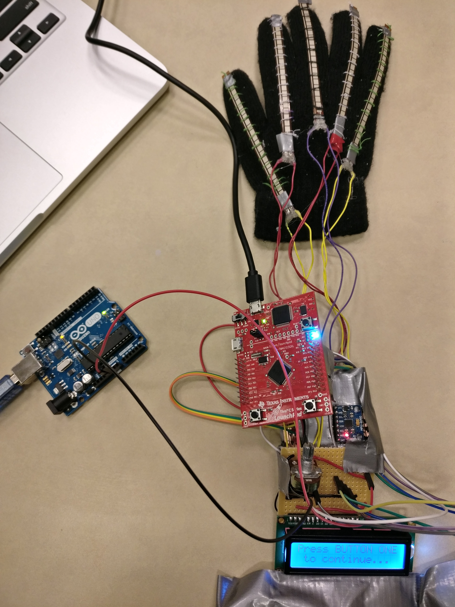

# Sign language interpretation glove
Using the Tiva LaunchPad board along with the orbit booster back to create a glove for basic sign language (letter) interpretation through the use of multiple flexible resistors and the on-board accelerometer.

## Major software components
- Data collection from flex sensors through analog input
- Mapping and calibration of flex sensor data on button input
- Data collection from orbit booster pack accelerometer
- Interpretation of flex sensor and accelerometer data and prediction of appropriate sign language character
- Displaying interpreted results on orbit booster pack LCD using the OrbitOled library

## Hardware components
- Five 4.5" SpectraSymbol flexible resistor/sensors will be connected to the
- TivaTMC Series LaunchPad board using twenty to forty jumper wires
- The TivaTMC Series LaunchPad board will then be attached to the glove
- Five 22,000ohm resistors will be used as voltage dividers
- The on-board accelerometer from the Orbit boosterpack will be used to detect gestures

## Hardware schematics
The full hardware schematics of this project can be found <a href = "Hardware_Schematics.pdf">here.</a>

